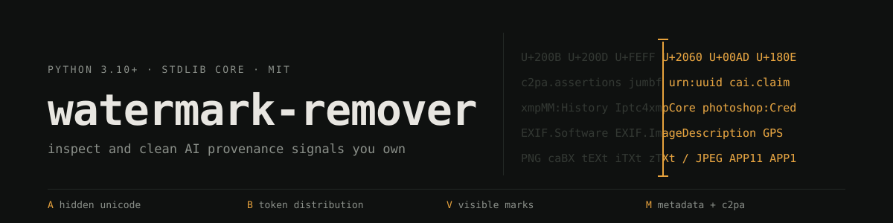

<p align="center">
  <a href="https://github.com/Pythoughts-labs/watermark-remover/actions/workflows/ci.yml"></a>
  <a href="https://github.com/Pythoughts-labs/watermark-remover/releases"></a>
  <a href="https://github.com/Pythoughts-labs/watermark-remover/stargazers"></a>
  <a href="LICENSE"></a>
</p>

Tools for finding and removing AI provenance signals from files you own. Four channels are covered: hidden Unicode in text, statistical token watermarks, visible marks burned into images, and metadata such as C2PA, EXIF, and XMP.

The core runs on Python 3.10+ using the standard library only. Anything that needs a network call, a model, a GPU, or a system binary sits behind an adapter you opt into, so the default install has no dependencies.

**Honesty contract:** deterministic cleaners report exactly what they removed. Rewrite, inpainting, and detector-evasion methods are labeled best-effort. Nothing here certifies that a vendor detector will fail.

## What ships

| Layer | Target | Method | Result class |
| --- | --- | --- | --- |
| **A** | Hidden Unicode, bidi controls, tags, exotic spaces | Context-aware deterministic scrub | Verifiable |
| **B** | Token-distribution text watermarks | Paraphrase, back-translation, structural rewrite, or TSAPA-style evolutionary search | Best-effort |
| **V** | Visible image logos and overlays | Mask, hole fill, dilation, inpaint, restore | Mask removal verifiable, fidelity best-effort |
| **M** | C2PA, EXIF, XMP, document properties | Format-aware metadata rewrite | Verifiable per format |
| Soft binding | Remote manifests, in-content binding | Detection and warning only | Detection only |
| SynthID | Pixel-domain SynthID-class signal | Optional external adapter | Score only |

Optional edges, none required by the core:

- `pypdf` for structural PDF rewrite
- `exiftool` and `c2patool` as system tools
- a local Ollama or OpenAI-compatible endpoint for Layer B
- an external detector, LaMa, MI-GAN, or diffusion command for visible marks
- `gradio` for the demo UI

---

## Quick start

```bash
git clone https://github.com/Pythoughts-labs/watermark-remover.git
cd watermark-remover
SCRIPTS=skills/remove-ai-marks/scripts

# Inspect before changing anything
python3 "$SCRIPTS/inspect_file.py" draft.md
python3 "$SCRIPTS/inspect_file.py" image.png --soft-binding

# Unified clean
python3 "$SCRIPTS/clean_file.py" draft.md -o draft.cleaned.md
python3 "$SCRIPTS/clean_file.py" image.png -o image.cleaned.png
```

### Install as an agent skill

```bash
# Project-local (Grok Build)
mkdir -p .grok/skills
ln -sfn "$(pwd)/skills/remove-ai-marks" .grok/skills/remove-ai-marks

# User-global
mkdir -p ~/.grok/skills
ln -sfn "$(pwd)/skills/remove-ai-marks" ~/.grok/skills/remove-ai-marks
```

Invoke with `/remove-ai-marks`, or ask to inspect or clean C2PA, hidden Unicode, visible marks, or statistical text marks.

### Batch mode

Directory mode preserves relative paths, skips its own `.cleaned.*`, `.mask.*`, and `.bak` artifacts, rejects output collisions, and returns non-zero when any file fails or retains a requested risk signal.

```bash
# All supported files below a directory
python3 "$SCRIPTS/clean_file.py" ./inputs -o ./cleaned --recursive

# Glob and extension allow-list
python3 "$SCRIPTS/clean_file.py" ./inputs -o ./cleaned \
  --recursive --glob "*.png" --extensions png

# Inspect a tree
python3 "$SCRIPTS/inspect_file.py" ./inputs --recursive --glob "*.md" --json
```

---

## Text

### Layer A, deterministic Unicode hygiene

```bash
python3 "$SCRIPTS/inspect_text.py" draft.txt --json
python3 "$SCRIPTS/clean_text.py" draft.txt -o draft.cleaned.txt --stats
```

Layer A removes or normalizes configured hidden carriers. Some Unicode is meaningful, so preservation rules are context-aware rather than blanket deletion: ZWJ and variation selectors affect emoji and orthographies, and bidi controls affect display order.

### Layer B, rewrite attacks

```bash
# No model call: emit an execution prompt
python3 "$SCRIPTS/rewrite_text.py" draft.txt \
  --backend print-prompt --strength paraphrase

# TSAPA-style operator pack, still no model call
python3 "$SCRIPTS/rewrite_text.py" draft.txt \
  --backend print-prompt --strength tsapa --generations 5 --population 12

# Execute against a local OpenAI-compatible endpoint
WATERMARKS_REWRITE_BACKEND=openai-compatible \
WATERMARKS_REWRITE_BASE_URL=http://127.0.0.1:8080 \
WATERMARKS_REWRITE_MODEL=my-local-model \
  python3 "$SCRIPTS/rewrite_text.py" draft.txt \
    --strength tsapa --generations 5 --population 12

# Qwen/Transformers-compatible servers: suppress reasoning preambles
WATERMARKS_REWRITE_DISABLE_THINKING=true \
  python3 "$SCRIPTS/rewrite_text.py" draft.txt \
    --backend openai-compatible --base-url http://127.0.0.1:8080 \
    --model my-thinking-model --strength paraphrase
```

The TSAPA-style engine is a real multi-objective evolutionary loop:

1. Generate a diverse candidate population.
2. Score attack fitness: PLL, n-gram diversity, lexical diversity.
3. Score fidelity: embedding cosine similarity, with a labeled shingle-Jaccard fallback.
4. Apply NSGA-II non-dominated sorting and crowding distance.
5. Cross over at sentence boundaries, mutate the lowest-PLL sentence.
6. Select the Pareto knee point.

A logprobs-capable `/v1/completions` endpoint supplies PLL, and `/v1/embeddings` supplies semantic similarity. Either can fail independently and degrade to an explicitly labeled standard-library proxy. `--disable-thinking` (or `WATERMARKS_REWRITE_DISABLE_THINKING=true`) opts into the Qwen/Transformers `chat_template_kwargs.enable_thinking=false` extension; it is never sent by default to generic OpenAI-compatible servers.

**Cost:** Layer B replaces the original wording and can flatten voice or precision. Prefer a non-origin model so the rewrite does not re-stamp the same scheme.

### Character-level perturbations

```bash
python3 "$SCRIPTS/perturb_text.py" draft.txt \
  --mode zero-width --strength 0.10 --seed 42
```

This is an opt-in anti-watermark transform inspired by 2026 character-perturbation research. It intentionally adds artifacts that Layer A removes. `zero-width` and `space-swap` are Layer-A reversible, `confusable` and `case` are not. It is not a hygiene pass and carries no detector guarantee.

---

## Visible image marks

[`morphomod.py`](skills/remove-ai-marks/scripts/morphomod.py) never guesses a watermark region. Supply one of:

- `--mask mask.pgm|mask.png` (white means remove)
- `--box X,Y,W,H`
- `--detect-command '...'` with `{input}`, `{mask}`, `{prompt}` placeholders

```bash
# Stdlib texture backend (default in clean_file): nearby-patch search
python3 "$SCRIPTS/morphomod.py" input.png -o output.png \
  --box 900,920,120,60 --dilation 3 --backend texture

# Uniform-background fallback
python3 "$SCRIPTS/morphomod.py" input.png -o output.png \
  --box 900,920,120,60 --dilation 3 --backend simple

# Production adapter: external detector and inpainter
python3 "$SCRIPTS/morphomod.py" input.png -o output.png \
  --detect-command 'detector --input "{input}" --output "{mask}"' \
  --backend external \
  --command 'inpainter --image "{input}" --mask "{mask}" --output "{output}"'

# Combined visible pass, then metadata clean
python3 "$SCRIPTS/clean_file.py" input.png -o output.png \
  --visible-mask mask.pgm --dilate 3 --visible-backend texture
```

The stdlib dilation is non-cascading and runs in O(width × height). PNG decoding supports non-interlaced 8-bit grayscale, RGB, and RGBA. The default `texture` backend searches nearby patches by boundary error and fully replaces the refined mask; optional feathering is available at the module interface. `simple` is retained for uniform backgrounds only. Neither is marketed as LaMa quality. JPEG visible cleaning requires an external backend, and that backend owns JPEG compositing.

Paper-reported MorphoMod improvements are not this implementation's measured results. The report includes initial and refined mask pixels and requires manual fidelity review.

---

## Metadata and provenance

```bash
# PNG, JPEG, HEIC, HEIF, AVIF
python3 "$SCRIPTS/clean_image.py" photo.heic -o photo.cleaned.heic

# Any supported format
python3 "$SCRIPTS/clean_file.py" document.pdf -o document.cleaned.pdf

# Detect soft-binding or remote-manifest risk
python3 "$SCRIPTS/inspect_soft_binding.py" image.png --json
```

C2PA facts the parser relies on:

- Manifest Stores use JUMBF and BMFF structures, claims and assertions, and COSE signatures.
- JPEG embeds through APP11/JUMBF.
- PNG uses the private ancillary `caBX` chunk, not generic `tEXt`.
- HEIF and AVIF are ISO-BMFF. Cleaning neutralizes matching JUMBF/C2PA UUID boxes and direct-file Exif and XMP extents in place, preserving offsets. Unsupported external or idat metadata layouts fail closed.

Soft-binding removal remains out of scope. The inspector warns when an in-content binding or remote manifest may re-link provenance after hard-bound metadata is stripped.

### PDF quality

PDF cleaning uses this fallback order:

1. `exiftool`
2. optional `pypdf` full-document clone (outlines, forms, attachments, and catalog retained, docinfo and XMP removed)
3. byte-exact unchanged copy with an explicit residual warning

```bash
python3 -m pip install pypdf
```

Encrypted PDFs are never regex-edited.

---

## Optional SynthID pixel scoring

The external [`aloshdenny/reverse-SynthID`](https://github.com/aloshdenny/reverse-SynthID) checkout is not bundled and stays under its upstream non-commercial research license.

```bash
SCRIPTS=skills/remove-ai-marks/scripts
"$SCRIPTS/setup_synthid.sh"

REVERSE_SYNTHID_DIR=~/reverse-SynthID \
  ~/reverse-SynthID/.venv/bin/python "$SCRIPTS/score_synthid.py" shot.png
```

Or build the scorer locally:

```bash
make docker-synthid-build
docker run --rm -v "$(pwd):/data" watermark-remover-synthid-scorer /data/shot.png
```

This is scoring only. That repository's carrier model and success figures are maintainer-reported reverse-engineering claims, not public Google architecture and not an independent guarantee.

---

## Format support

| Format | Inspect and clean behavior |
| --- | --- |
| PNG | `caBX`, text, XMP, and EXIF chunks, plus the optional visible pipeline |
| JPEG | APP11/JUMBF and APP metadata, external visible backend supported |
| HEIC, HEIF, AVIF | ISO-BMFF brands, JUMBF/C2PA UUID boxes, direct-file Exif and XMP extents. Unsupported external or idat layouts fail closed |
| SVG | `<metadata>`, XMP, provenance-like comments |
| PDF | XMP and docinfo via exiftool or a full-document pypdf clone, otherwise an unchanged copy |
| DOCX | docProps cleaned, customXml inspected and preserved to avoid application-data loss |
| ODT | meta.xml and generator-like metadata |
| HTML | meta tags, provenance JSON-LD, `data-ai*` attributes |
| Markdown | AI-like YAML frontmatter plus a Layer A body pass |
| Text and code | Layer A, optional Layer B or character perturbation |

---

## Interesting techniques

**Context-aware Unicode scrubbing.** [`text_unicode.py`](skills/remove-ai-marks/scripts/text_unicode.py) classifies every hidden carrier rather than deleting a blocklist. Zero-width joiners hold emoji sequences together and variation selectors change glyph form, so those survive. Tag characters and bidi overrides do not. Bidi handling follows the same directional model browsers expose through [`unicode-bidi`](https://developer.mozilla.org/en-US/docs/Web/CSS/unicode-bidi), and cleaned text is normalized to NFC, the form described under [`String.prototype.normalize()`](https://developer.mozilla.org/en-US/docs/Web/JavaScript/Reference/Global_Objects/String/normalize).

**NSGA-II inside a text rewriter.** [`tsapa.py`](skills/remove-ai-marks/scripts/tsapa.py) is a genuine multi-objective loop, not a prompt template: population generation, non-dominated sorting, crowding distance, crossover at sentence boundaries, mutation targeted at the weakest sentence, and Pareto knee selection. Attack strength and semantic fidelity are optimized as two separate objectives so neither silently wins.

**Scoring that names its own fallback.** Pseudo-log-likelihood comes from an OpenAI-compatible endpoint with logprobs, and cosine similarity from an embeddings endpoint. Either can fail on its own and drop to a standard-library proxy, which is reported as a proxy rather than passed off as the real measurement.

**Non-cascading dilation in pure Python.** [`morphomod.py`](skills/remove-ai-marks/scripts/morphomod.py) dilates a mask in a single pass against the original buffer, so growth does not compound across iterations. It runs in O(width × height) with no array library.

**Patch-based inpainting with no model.** The default visible backend searches nearby patches by boundary error, picks the best match, and fully replaces the refined mask so watermark pixels cannot bleed through. It is not LaMa quality and is not sold as such, but it needs nothing installed.

**In-place ISO-BMFF neutralization.** [`heif_meta.py`](skills/remove-ai-marks/scripts/heif_meta.py) overwrites JUMBF and C2PA UUID boxes and direct-file Exif and XMP extents without moving anything, so every byte offset in the file stays valid. Layouts it cannot prove safe fail closed instead of being rewritten.

**PNG chunk surgery.** [`image_meta.py`](skills/remove-ai-marks/scripts/image_meta.py) walks the chunk stream, removes the private ancillary `caBX` chunk that C2PA actually uses in PNG, and recomputes CRCs with `zlib.crc32`.

**Markup-aware container cleaning.** [`container_meta.py`](skills/remove-ai-marks/scripts/container_meta.py) targets SVG [`<metadata>`](https://developer.mozilla.org/en-US/docs/Web/SVG/Element/metadata) elements, HTML [`<meta>`](https://developer.mozilla.org/en-US/docs/Web/HTML/Element/meta) tags, JSON-LD provenance blocks, and [`data-*` attributes](https://developer.mozilla.org/en-US/docs/Web/HTML/Global_attributes/data-*) matching `data-ai*`. DOCX `customXml` is inspected and kept, because deleting it loses application data.

**Fallback chains that degrade loudly.** PDF cleaning tries `exiftool`, then a full-document `pypdf` clone, then a byte-exact copy with an explicit residual warning. The third case still returns a file, and still tells you nothing was removed.

**The banner is drawn, not exported.** [`assets/banner.svg`](assets/banner.svg) uses two overlapping [`<clipPath>`](https://developer.mozilla.org/en-US/docs/Web/SVG/Element/clipPath) regions over one duplicated block of text, so the same codepoints render dim on the left and lit on the right. That puts the scrub line in the middle with no gradient mask and no raster asset.

## Technologies and libraries

Nothing below is required to run the core.

- [pypdf](https://github.com/py-pdf/pypdf) for a structural PDF clone that keeps outlines, forms, and attachments while dropping docinfo and XMP.
- [ExifTool](https://exiftool.org/) and [c2patool](https://github.com/contentauth/c2patool) as system binaries, used when present.
- [Gradio](https://www.gradio.app/) for [`demo.py`](demo.py), which calls the same modules as the CLI rather than reimplementing them.
- [Ollama](https://ollama.com/) or any OpenAI-compatible endpoint for Layer B execution. Tests inject a fake callable instead.
- [LaMa](https://github.com/advimman/lama) and [MI-GAN](https://github.com/Picsart-AI-Research/MI-GAN) as external inpainting commands behind the `external` backend.
- [reverse-SynthID](https://github.com/aloshdenny/reverse-SynthID) for optional pixel scoring. Not bundled, and non-commercial upstream.
- [pytest](https://docs.pytest.org/) and [Ruff](https://docs.astral.sh/ruff/) for the gate behind `make check`.
- The [C2PA specification](https://spec.c2pa.org/specifications/specifications/2.4/specs/C2PA_Specification.html) and JUMBF (ISO/IEC 19566-5) define the box structures the parsers walk.

The banner loads no web font. It requests a system monospace stack in order: `ui-monospace`, [SF Mono](https://developer.apple.com/fonts/), Menlo, [Consolas](https://learn.microsoft.com/en-us/typography/font-list/consolas), [DejaVu Sans Mono](https://dejavu-fonts.github.io/), then generic `monospace`. GitHub proxies README images, so an external font request would be stripped anyway.

## Project structure

```
watermark-remover/
├── .github/
│   ├── ISSUE_TEMPLATE/
│   └── workflows/
├── assets/
├── research/
├── skills/
│   └── remove-ai-marks/
│       ├── references/
│       └── scripts/
├── tests/
│   └── fixtures/
├── CODE_OF_CONDUCT.md
├── CONTRIBUTING.md
├── DESIGN.md
├── Dockerfile.synthid
├── LICENSE
├── Makefile
├── README.md
├── SECURITY.md
├── demo.py
├── pyproject.toml
├── pytest.ini
├── requirements-demo.txt
└── requirements-test.txt
```

[`skills/remove-ai-marks/`](skills/remove-ai-marks) is the whole product. It is laid out as an agent skill so it can be symlinked into `.grok/skills` or `~/.grok/skills` and invoked directly, but [`scripts/`](skills/remove-ai-marks/scripts) is a set of ordinary CLIs that work on their own. [`references/`](skills/remove-ai-marks/references) holds the source notes the parsers were built from, including [`ethics.md`](skills/remove-ai-marks/references/ethics.md) and the vendor behavior notes.

`research/` is intentionally gitignored local evidence and dogfood material; the durable claims discipline is captured in [`DESIGN.md`](DESIGN.md). [`assets/`](assets) holds repository images. [`tests/fixtures/`](tests/fixtures) holds the small binary files the format parsers are tested against.

## Coverage and limits

| Channel | What this does | What can remain |
| --- | --- | --- |
| Hidden text | Deterministic scrub | Meaningful Unicode kept by policy |
| Statistical text | Best-effort rewrite or evolutionary search | A strong or updated detector signal |
| Visible images | Mask, dilation, inpaint | Missed regions, inpaint artifacts |
| Hard-bound metadata | Format-aware stripping | Soft bindings, remote manifests, pixel marks |
| Pixel SynthID-class | Optional external score | The pixel, audio, and video watermark itself |
| Training backdoors | Nothing | Out of scope |

No public universal text detector exists, and a detector miss does not prove every trace is gone. Stronger attacks trade fidelity for lower detectability, and provider implementations keep changing.

## Ethics

Built for privacy, hygiene, accessibility, and research on content you own. Not for academic fraud, evading disclosure requirements, or claiming output is proven human-written. See [`ethics.md`](skills/remove-ai-marks/references/ethics.md).

---

## Optional demo

```bash
python3 -m pip install -r requirements-demo.txt
python3 demo.py
```

The demo calls the same modules as the CLI, it is not a second implementation. Layer B prompt generation is limited to plain-text uploads, and binary document extraction is deliberately not guessed.

## Development

```bash
python3 -m venv .venv
.venv/bin/pip install -r requirements-test.txt
make check
```

## Documentation

- [`DESIGN.md`](DESIGN.md), architecture, seams, guarantee classes, roadmap
- [`SKILL.md`](skills/remove-ai-marks/SKILL.md), agent workflow
- [`mark-classes.md`](skills/remove-ai-marks/references/mark-classes.md), [`removal-matrix.md`](skills/remove-ai-marks/references/removal-matrix.md), [`vendor-notes.md`](skills/remove-ai-marks/references/vendor-notes.md)
- [`CONTRIBUTING.md`](CONTRIBUTING.md) and [`SECURITY.md`](SECURITY.md)

## License

MIT, see [LICENSE](LICENSE).

## Primary references

- Anthropic, [*How Claude marks AI-generated content*](https://support.claude.com/en/articles/16266773-how-claude-marks-ai-generated-content)
- Dathathri et al., [*Scalable watermarking for identifying large language model outputs*](https://www.nature.com/articles/s41586-024-08025-4) (SynthID-Text, Nature 2024)
- Zhao et al., [*Invisible Image Watermarks Are Provably Removable Using Generative AI*](https://proceedings.neurips.cc/paper_files/paper/2024/hash/10272bfd0371ef960ec557ed6c866058-Abstract-Conference.html) (NeurIPS 2024)
- [UnMarker](https://arxiv.org/abs/2405.08363) (IEEE S&P 2025)
- [CtrlRegen](https://arxiv.org/abs/2410.05470) (ICLR 2025)
- [C2PA specification](https://spec.c2pa.org/specifications/specifications/2.4/specs/C2PA_Specification.html)
- Kirchenbauer et al., [*A Watermark for Large Language Models*](https://arxiv.org/abs/2301.10226)

---

[](https://github.com/Pythoughts-labs/watermark-remover)
[](https://hits.sh/github.com/Pythoughts-labs/watermark-remover/)
